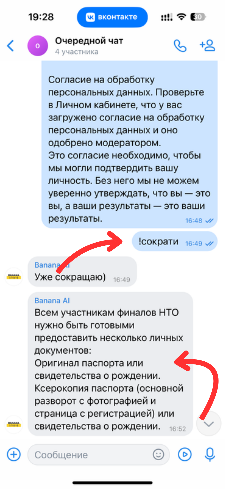

# СириусИИ 2024

## Команда
- Поладов Селим
- Грицкевич Константин
- Саблин Георгий
- Одегов Николай

## Описание проекта
Этот репозиторий содержит решения для двух задач, связанных с анализом текста, реализованные в рамках проекта СириусИИ 2024.

## Задачи и файлы
### 1. Анализ тональности
- **ToneClassification.ipynb**: В этом файле представлена модель для анализа тональности текста на основе LogisticRegression из библиотеки scikit-learn.
- **ToneClassificationTransformers.ipynb**: Здесь представлена модель для анализа тональности текста, использующая трансформеры с использованием BERT.

### 2. Классификация текстов по темам
- **TopicClassification.ipynb**: В этом файле реализована модель для классификации текстов по темам на основе ClassifierChain из библиотеки scikit-learn.

## Использование
Каждый из Jupyter Notebook файлов содержит код, а также поясняющие комментарии к нему. Для запуска моделей рекомендуется использовать среду, поддерживающую язык программирования Python и установленные библиотеки, указанные в файлах.

# Прототип решения на финал

Мы подготовили прототип решения на финал. Разработанная нами модель основана на трансформерах с использованием BERT для суммаризации сообщений в беседах ВКонтакте. Прототипом является бот сообщества ВК, который суммаризирует сообщения из беседы ВК.

## Ссылка на сообщество
[Сообщество Banana AI](https://vk.com/banana_ai)

## Добавление бота в беседу
Для добавления бота в беседу необходимо:
1. Нажать на кнопку "Добавить в чат".
2. Выбрать необходимый чат.
3. Предоставить боту полный доступ к беседе.

    
    

Добавления бота в чат | Установление прав доступа для бота

## Использование
После того как вы добавили бота в беседу и было написано много сообщений, вы можете суммаризировать их с помощью команды "!сократи".

Это всего лишь прототип. Реальное решение представлено в последнем слайде презентации, где для суммаризации пользователь взаимодействует с встроенным интерфейсом приложения.

Использование бота

## Score

| Metric   | R         | P       | F        |
|----------|-----------|---------|----------|
| rouge-1  | 0.244     | 1.0     | 0.392    |
| rouge-2  | 0.199     | 0.968   | 0.330    |
| rouge-l  | 0.244     | 1.0     | 0.392    |

**R** - Recall - отношение числа правильно предсказанных положительных классов к общему числу реальных положительных классов.

**P** - Precision - отношение числа правильно предсказанных положительных классов к общему числу предсказанных положительных классов.

**F** - F1 Score - гармоническое среднее Precision и Recall, используется как метрика, объединяющая Precision и Recall в одно число.

--- 

*Данный проект разработан командой BananaStudio. Спасибо за ваш интерес к нашему проекту!*
